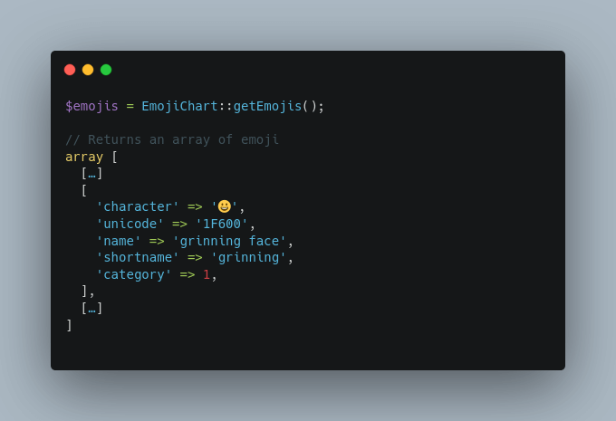

# Emoji Chart

[](https://packagist.org/packages/pixelbrackets/emoji-chart/)
[](https://gitlab.com/pixelbrackets/emoji-chart/pipelines)
[](https://gitlab.com/pixelbrackets/emoji-chart#requirements)
[](https://spdx.org/licenses/GPL-2.0-or-later.html)

This package provides a static list of [Emoji](https://de.wikipedia.org/wiki/Emoji).

The object returns an array which contains an Emoji string, the unicode
codepoint, a unique name, a short name as supported in Slack or GitHub,
and a category.



## Requirements

- PHP

## Installation

Packagist Entry https://packagist.org/packages/pixelbrackets/emoji-chart/

## Source

https://gitlab.com/pixelbrackets/emoji-chart/

## Usage

See [tests/demo.php](./tests/demo.php)

1. Get an array with all Emojis
   ```php
   $colorChart = new \Pixelbrackets\EmojiChart\EmojiChart();
   $emojis = $colorChart->getEmojis();
   ```
    Or as static method call
   ```php
   $emojis = \Pixelbrackets\EmojiChart\EmojiChart::getEmojis();
   ```
1. Get an array with all categories
   ```php
   $categories = \Pixelbrackets\EmojiChart\EmojiChart::getCategories();
   ```
1. Get an array with all Emojis grouped by category
   ```php
   $groupedEmojis = \Pixelbrackets\EmojiChart\EmojiChart::getEmojisGroupedByCategory();
   ```
1. Get an array of a single Emoji
   ```php
   $emoji = \Pixelbrackets\EmojiChart\EmojiChart::getEmoji('grinning face');
   ```

## License

GNU General Public License version 2 or later

The GNU General Public License can be found at http://www.gnu.org/copyleft/gpl.html.

The list is based upon the great NPM package
[emoji-datasource](https://github.com/iamcal/emoji-data) (MIT).

## Author

Dan Untenzu (<mail@pixelbrackets.de> / [@pixelbrackets](https://pixelbrackets.de))

## Changelog

See [./CHANGELOG.md](CHANGELOG.md)

## Contribution

This script is Open Source, so please use, patch, extend or fork it.
